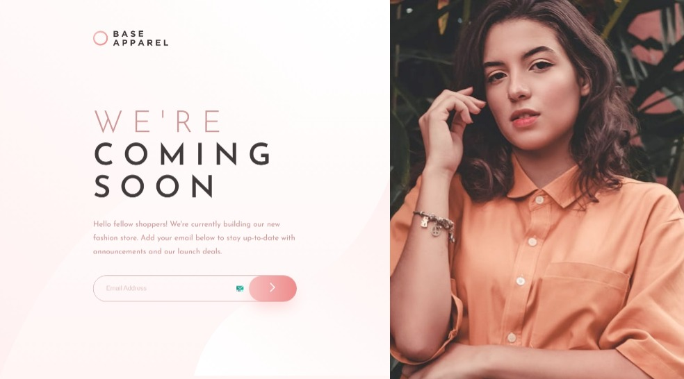

<div align="center">
    
    <h2><strong>Order Summary Component Solution</strong></h2>
    <a href="https://www.frontendmentor.io/challenges/base-apparel-coming-soon-page-5d46b47f8db8a7063f9331a0"><strong>Frontend Mentor Challenge</strong></a>
    <br/>
    <br/>
    <a href="https://base-apparel-coming-soon-mh.netlify.app/" target="_blank">View Demo</a>
    -
    <a href="https://github.com/MrMohammedMath/base-apparel-coming-soon/issues" target="_blank">Report Bug</a>
    -
    <a href="https://github.com/MrMohammedMath/base-apparel-coming-soon/issues" target="_blank">Request Feature</a>
    <br/>
    <!-- Profile -->
    <a href="https://www.frontendmentor.io/profile/MrMohammedMath">
        
    </a>
    <!-- Status -->
        
    <br/>
    <h3><strong>Built with</strong></h3>
    
     
    
    
</div>


### **Usage**

```bash
  git clone https://github.com/MrMohammedMath/base-apparel-coming-soon.git

  cd base-apparel-coming-soon

  npm install
```

- for running dev server

```bash
npm run start
```

- for build & review

```bash
npm run build && npm run preview
```


